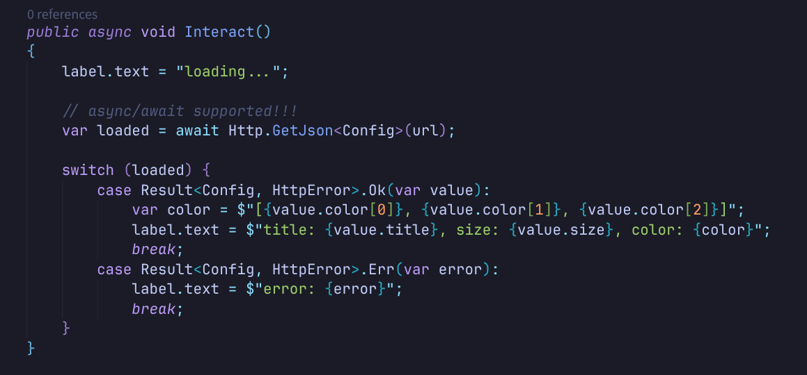
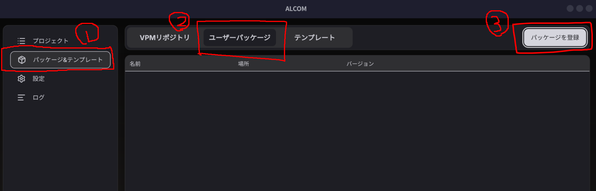
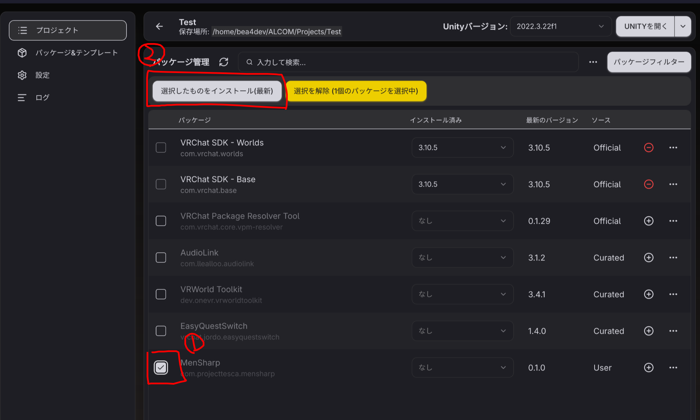
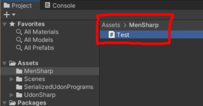
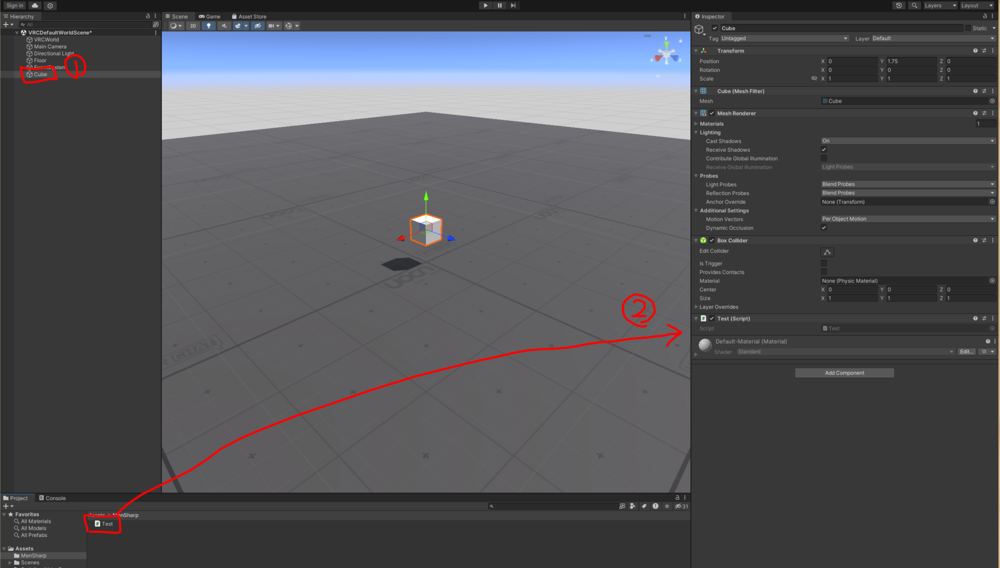
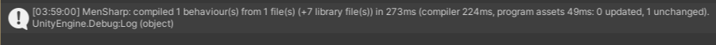
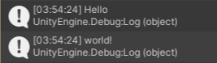

<div align="center">
<h1>MenSharpコンパイラー(M#)</h1>
<p>C# → UdonAssemblyへコンパイルする世界最速のC#コンパイラ</p>
</div>



<div style="page-break-before:always"></div>

# 目次

 - [はじめに](#はじめに)
 - [インストール方法](#インストール方法)
   - [ALCOMの場合](#alcomの場合)
 - [使い方](#使い方)
 - [配布方法](#配布方法)
 - [Q&A](#qa)

<div style="page-break-before:always"></div>

# はじめに
MenSharpとはVRChatで使用されるUdon Assemblyへのコンパイラです。

世界最速のC#コンパイラであり、C#公式のRoslynコンパイラより3倍程度、UdonSharpコンパイラ比では10倍以上高速に動作します。

使用できるC#機能は**ほぼ全て**で、現時点でサポートしていないのはThread, lock, FileIO, VRC SDKを経由しないネットワークアクセス等のごく一部の機能のみです。

原則として、非対応機能を使ったコードがコンパイルされるときには明示的なエラーが発生してコンパイルが停止します。実行時エラーにはなりません。

<div style="page-break-before:always"></div>

# 第一章: 基本的な使用方法

## インストール方法
インストールは非常に簡単です。

### ALCOMの場合
まずはMenSharpパッケージのzipをダウンロードして適当なディレクトリに展開します。

その後、ALCOMのパッケージのタブから先ほど展開したパッケージを登録します。



次に、プロジェクトを新規作成するか既存のプロジェクトの管理画面を開きます。開いたら先ほど登録したパッケージをプロジェクトにインストールします。



<div style="page-break-before:always"></div>

## 使い方
正しくインストールができていれば、プロジェクトを開いた時点で`Assets/MenSharp`ディレクトリが作成されているはずです。

まずは、ここに適当なC#スクリプトファイル`Test.cs`を作成してください。



次にシーンにCubeを追加してCubeのInspectorに先ほど作成した`Test.cs`をドラッグアンドドロップします。



<div style="page-break-before:always"></div>

次に以下のように`Test.cs`を記述してみてください。

```cs
using System.Collections.Generic;
using MenSharp;
using UnityEngine;

public class Test : MenSharpBehaviour
{
    public void Interact()
    {
        var list = new List<string> { "Hello", "world!" };
        
        foreach (var value in list) {
            Debug.Log(value);
        }
    }
}
```

::: warning
**Warning:** もしエディタ補完等が使えない場合には一度スクリプトを保存してUnityを再度フォーカスし直してみてください。
:::

書き換えが終わったら保存してUnityを再度フォーカスしてみてください。

自動的にMenSharpのコンパイルが走り、以下のように表示されるはずです。



最後にPlayボタンを押してCubeをクリックし、以下のように出れば成功です。



<div style="page-break-before:always"></div>

## 配布方法
パッケージ配布やワールドアップロード方法はUdonの場合と全く同じ手順で行うことが出来ます。

パッケージを配布する場合には、Unityのメニューから`MenSharp → Create Package...`で雛形を作成できるので、これを活用することを推奨します。

::: warning
**Warning:** 利用者はMenSharpパッケージを別途先にインストールする必要があります。
:::

<div style="page-break-before:always"></div>

## Q&A

> **Q. OSSとして公開する予定はありますか？**
> 
> A. もちろんです！一通りのクローズドテストが終われば公開されます！

> **Q. サポートされているプラットフォームは？**
>
> A. UdonAssemblyにコンパイルされるのでVRCの対応プラットフォールと同じです。ただし、コンパイラ本体はWindows, MacOS(Apple Silicon), Linuxのみサポートされます。

> **Q. ライセンスは？**
> 
> A. コンパイラのソースはMITライセンスです。なので**M#を使用してコンパイルした結果のUdonAssemblyにはライセンスは付与されません**。ご自由に使用してください！