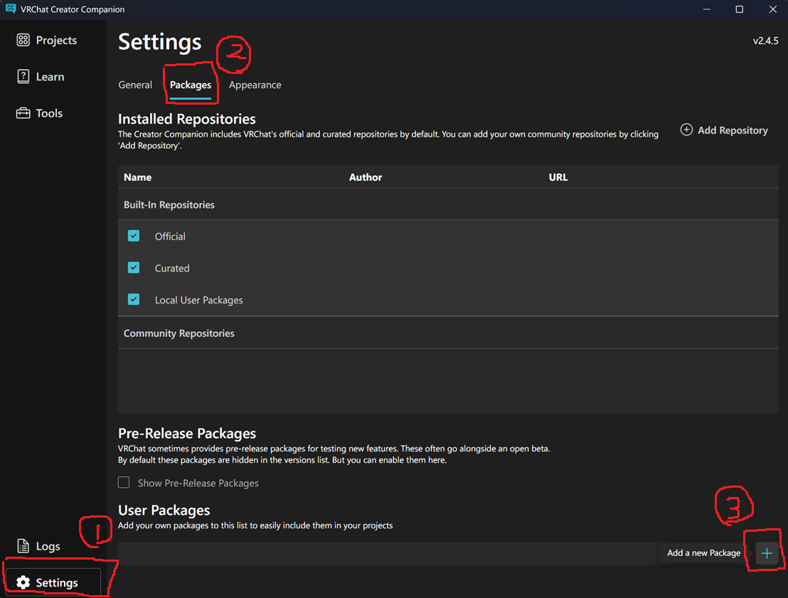
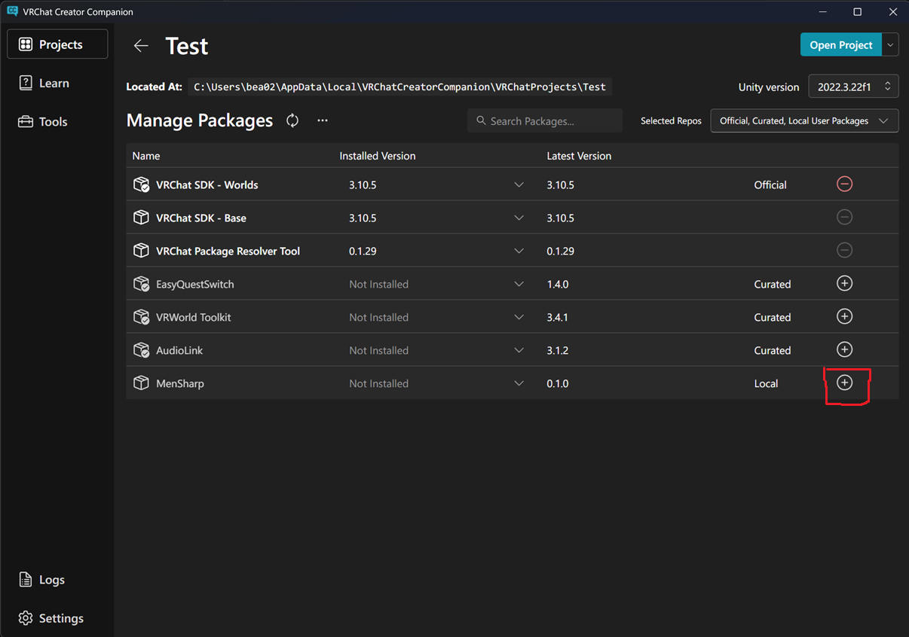

<div align="center">
<h1>MenSharpコンパイラー(M#)</h1>
<p>C# → UdonAssemblyへコンパイルする世界最速のC#コンパイラ</p>
</div>


<div style="page-break-before:always"></div>

# 目次

 - [はじめに](#はじめに)
 - [インストール方法](#インストール方法)
   - [ALCOMの場合](#alcomの場合)
 - [使い方](#使い方)
 - [配布方法](#配布方法)
 - [使用可能な記法一覧](#使用可能な記法一覧)
   - [M# std](#m-std)
   - [その他](#その他)
 - [Q&A](#qa)

<div style="page-break-before:always"></div>

# はじめに
MenSharpとはUdon Assemblyへのコンパイラです。

世界最速のC#コンパイラであり、C#公式のRoslynコンパイラより3倍程度、UdonSharpコンパイラ比では10倍以上高速に動作します。

使用できるC#機能は**ほぼ全て**で、現時点でサポートしていないのはThread, lock, FileIO, VRC SDKを経由しないネットワークアクセス等のごく一部の機能のみです。

原則として、非対応機能を使ったコードがコンパイルされるときには明示的なエラーが発生してコンパイルが停止します。実行時エラーにはなりません。

<div style="page-break-before:always"></div>

# 第一章: 基本的な使用方法

## インストール方法
インストールは非常に簡単です。

### VCC(VRChat Creator Companion)の場合
まずはMenSharpパッケージのzipをダウンロードして適当なディレクトリに展開します。

その後、VCCの設定のパッケージタブからユーザーパッケージとして追加します。



次に、プロジェクトを新規作成するか既存のプロジェクトの管理画面を開いてMenSharpを追加します。



追加できたら、次の[使い方](#使い方)セクションに進んでください。

<div style="page-break-before:always"></div>

### ALCOMの場合
まずはMenSharpパッケージのzipをダウンロードして適当なディレクトリに展開します。

その後、ALCOMのパッケージのタブから先ほど展開したパッケージを登録します。


次に、プロジェクトを新規作成するか既存のプロジェクトの管理画面を開きます。開いたら先ほど登録したパッケージをプロジェクトにインストールします。


追加できたら、次の[使い方](#使い方)セクションに進んでください。

<div style="page-break-before:always"></div>

## 使い方
正しくインストールができていれば、プロジェクトを開いた時点で`Assets/MenSharp`ディレクトリが作成されているはずです。

まずは、ここに適当なC#スクリプトファイル`Test.cs`を作成してください。


次にシーンにCubeを追加してCubeのInspectorに先ほど作成した`Test.cs`をドラッグアンドドロップします。


<div style="page-break-before:always"></div>

次に以下のように`Test.cs`を記述してみてください。

```cs
using System.Collections.Generic;
using MenSharp;
using UnityEngine;

public class Test : MenSharpBehaviour
{
    public void Interact()
    {
        var list = new List<string> { "Hello", "world!" };
        
        foreach (var value in list) {
            Debug.Log(value);
        }
    }
}
```

::: warning
**Warning:** もしエディタ補完等が使えない場合には一度スクリプトを保存してUnityを再度フォーカスし直してみてください。
:::

書き換えが終わったら保存してUnityを再度フォーカスしてみてください。

自動的にMenSharpのコンパイルが走り、以下のように表示されるはずです。


最後にPlayボタンを押してCubeをクリックし、以下のように出れば成功です。


このように、MenSharpはソースコードが保存されると自動的にUdon Assemblyへコンパイルされ、ドラッグアンドドロップするだけで自動的に登録されます。

<div style="page-break-before:always"></div>

## 配布方法
パッケージ配布やワールドアップロード方法はUdonの場合と全く同じ手順で行うことが出来ます。

パッケージを配布する場合には、Unityのメニューから`MenSharp → Create Package...`で雛形を作成できるので、これを活用することを推奨します。

::: warning
**Warning:** 利用者はMenSharpパッケージを別途先にインストールする必要があります。
:::

<div style="page-break-before:always"></div>

## 使用可能な記法一覧
> **Warning:** 完全に網羅しているわけではありません。対応している記法はこれ以外にもあります。

### M# std
M#専用のstdライブラリが存在しています。まずはこれらの使用例を紹介します。

#### `MenSharp.Net.Http`とasync/await
```cs
using MenSharp;
using MenSharp.Net;
using UnityEngine;
using VRC.SDKBase;

public class Motd
{
    public string message;
}

public class ExHttp : MenSharpBehaviour
{
    public VRCUrl url;          // SDK の要求どおり Inspector で設定

    public async void Interact()
    {
        // 生テキスト
        Result<string, HttpError> text = await Http.GetString(url);
        text.Switch(
            body => Debug.Log("got " + body.Length + " chars"),
            error => Debug.LogWarning(error.ToString()));   // "400: Invalid URL"

        // そのまま型へ
        Result<Motd, HttpError> loaded = await Http.GetJson<Motd>(url);
        switch (loaded)
        {
            case Result<Motd, HttpError>.Ok(var motd):
                Debug.Log(motd.message);
                break;
            case Result<Motd, HttpError>.Err(var error):
                Debug.LogWarning(error.Code + " " + error.Message);
                break;
        }
    }
}
```

<div style="page-break-before:always"></div>

#### `MenSharp.Json`
```cs
using MenSharp;
using MenSharp.Json;
using UnityEngine;

public class Player
{
    public string name;
    [JsonName("level")] public int Level { get; set; }
    [JsonIgnore] public float cachedScore;
}
public class Config
{
    [JsonRequired] public string title;
    public float size;
    public float[] color;
    public System.Collections.Generic.List<Player> players;
    public int? maxPlayers;
}
public class ExJson : MenSharpBehaviour
{
    public void Start()
    {
        string text = "{\"title\":\"hello\",\"size\":2.5,\"color\":[1,0,0]," +
                    "\"players\":[{\"name\":\"a\",\"level\":3}],\"maxPlayers\":16}";

        Result<Config, JsonError> parsed = Json.Parse<Config>(text);
        switch (parsed)
        {
            case Result<Config, JsonError>.Ok(var config):
                Debug.Log(config.title + " " + config.players[0].Level + " " + config.maxPlayers);
                break;
            case Result<Config, JsonError>.Err(var error):
                Debug.LogWarning(error.Path + ": " + error.Message);   // "$.players[0].level: ..."
                break;
        }
        // out 形式
        Config value;
        string why;
        if (Json.TryParse<Config>(text, out value, out why))
        {
            Debug.Log(value.size);
        }
    }
}
```

<div style="page-break-before:always"></div>

#### `Result<T, E>`, `Option<T>`

```cs
using MenSharp;
using UnityEngine;
using static MenSharp.Result;   // Ok(...) / Err(...) を裸の名前で

public class ExResult : MenSharpBehaviour
{
    public string input;

    private Result<int, string> ParseCount(string text)
    {
        int value;
        if (!int.TryParse(text, out value))
        {
            return Err("not a number: " + text);   // E は戻り値型から決まる
        }
        if (value < 0)
        {
            return Err("negative: " + value);
        }
        return Ok(value);                          // T も同様
    }

    public void Start()
    {
        Result<int, string> parsed = ParseCount(input);

        // 1. 網羅的 switch — case を忘れるとコンパイルエラー
        switch (parsed)
        {
            case Result<int, string>.Ok(var count):
                Debug.Log("count = " + count);
                break;
            case Result<int, string>.Err(var error):
                Debug.LogWarning(error);
                break;
        }

        // 2. 二択のアクション / 二択の答え
        parsed.Switch(count => Debug.Log(count), error => Debug.LogWarning(error));
        int safe = parsed.Match(count => count, error => 0);

        // 3. out 形式
        int value;
        string why;
        if (parsed.TryGet(out value, out why))
        {
            Debug.Log("ok " + value);
        }

        // 4. コンビネータ
        Result<int, string> doubled = parsed.Map(count => count * 2);
        Result<int, string> chained = parsed.AndThen(count => ParseCount(count.ToString()));
        Debug.Log(doubled.UnwrapOr(0) + " " + chained.IsOk + " " + safe);

        // Option<T>
        Option<int> maybe = Find(3);
        Debug.Log(maybe.Match(v => "found " + v, () => "none"));
        Result<int, string> required = maybe.OkOr("not there");
        Debug.Log(required.ToString());
    }

    private Option<int> Find(int wanted)
    {
        int[] values = new int[] { 1, 2, 3 };
        foreach (int value in values)
        {
            if (value == wanted)
            {
                return Option.Some(value);
            }
        }
        return Option.None;
    }
}
```

<div style="page-break-before:always"></div>

#### `MenSharp.Reflection`静的リフレクション

```cs
using MenSharp;
using MenSharp.Reflection;
using UnityEngine;

// visitor は型のフィールドを 1 つずつ、それぞれの静的型で受け取る。
// Visit<TField> はコンパイル時にフィールドごとに実体化される。
public class Dumper : IFieldVisitor
{
    public string Text;

    public void Visit<TField>(FieldInfo field, ref TField value)
    {
        if (!field.IsPublic)
        {
            return;
        }
        Text = Text == null ? "" : Text + ", ";
        Text = Text + field.Name + "=" + value;
    }
}

// 自前の属性は普通のクラス。構築済みインスタンスが FieldInfo.Attribute<A>() で取れる
public class LabelAttribute : System.Attribute
{
    public readonly string Name;

    public LabelAttribute(string name)
    {
        Name = name;
    }
}

public struct Stats
{
    [Label("hp")] public int Health;
    public float Speed;
    public string Name;
}

public class Ex4Reflect : MenSharpBehaviour
{
    public void Start()
    {
        var stats = new Stats();
        stats.Health = 10;
        stats.Speed = 3.5f;
        stats.Name = "player";

        var dumper = new Dumper();
        Reflect.VisitFields(ref stats, dumper);
        Debug.Log(dumper.Text);       // Health=10, Speed=3.5, Name=player

        Debug.Log(Describe<int[]>());
        Debug.Log(Describe<Stats>());
    }

    // 以下の判定はすべて定数。if は取られる枝だけが残る
    private string Describe<T>()
    {
        if (Reflect.IsArray<T>())
        {
            return "an array";
        }
        else if (Reflect.IsList<T>())
        {
            return "a List";
        }
        else if (Reflect.IsNullable<T>())
        {
            return "a nullable";
        }
        else if (Reflect.IsEnum<T>())
        {
            return "an enum";
        }
        else if (Reflect.Is<T, int>() || Reflect.Is<T, string>())
        {
            return "a primitive";
        }
        else if (Reflect.IsObject<T>())
        {
            return "an object with fields";
        }
        else
        {
            // ここに到達する T があればビルドがその型名を挙げて落ちる
            Reflect.Unsupported<T>("Describe");
            return null;
        }
    }
}
```

<div style="page-break-before:always"></div>

### その他

#### async/awaitを使った Task / Scheduler

```cs
using System.Threading;
using System.Threading.Tasks;
using MenSharp;
using UnityEngine;

public class Ex5Async : MenSharpBehaviour
{
    private CancellationTokenSource running;

    public async void Start()
    {
        await Scheduler.Delay(1f);          // 秒
        await Scheduler.NextFrame();
        await Scheduler.DelayFrames(10);
        await Task.Delay(500);              // ミリ秒（.NET と同じ）

        await Scheduler.WaitUntil(() => Time.time > 5f);

        // 同時に 2 つ
        await Task.WhenAll(Step("a", 0.5f), Step("b", 1f));

        // 投げっぱなし: 例外はイベントを殺さずログに出る
        Scheduler.Run(() => Step("background", 2f));

        // キャンセル
        running = new CancellationTokenSource();
        running.CancelAfter(3000);
        await Loop(running.Token);
    }

    public void Interact()
    {
        if (running != null)
        {
            running.Cancel();
        }
    }

    private async Task Step(string name, float seconds)
    {
        await Scheduler.Delay(seconds);
        Debug.Log(name);
    }

    private async Task<int> Count(int to)
    {
        int total = 0;
        for (int i = 0; i < to; i++)
        {
            total = total + i;
            await Scheduler.NextFrame();    // 処理をフレームに分散
        }
        return total;
    }

    private async Task Loop(CancellationToken token)
    {
        try
        {
            while (true)
            {
                await Scheduler.Delay(0.25f, token);
                Debug.Log(await Count(3));
            }
        }
        catch (System.OperationCanceledException)
        {
            Debug.Log("stopped");
        }
    }
}
```

他に Scheduler.WaitWhile / Scheduler.Yield()、Task.CompletedTask / Task.FromResult /Task.WhenAny、TaskCompletionSource<T>（TrySetResult / TrySetException）、task.After(seconds) / task.OnNextFrame() / task.AfterFrames(n)。

<div style="page-break-before:always"></div>

#### コレクションとLINQ
```cs
using System.Collections.Generic;
using System.Linq;
using MenSharp;
using UnityEngine;

public class Score
{
    public string name;
    public int points;
}

public class Ex6Collections : MenSharpBehaviour
{
    public void Start()
    {
        var scores = new List<Score>();
        scores.Add(NewScore("a", 30));
        scores.Add(NewScore("b", 10));
        scores.Add(NewScore("c", 20));

        // List<T>
        Debug.Log(scores.Count);
        scores.Sort((x, y) => y.points - x.points);
        Score best = scores.Find(s => s.points > 25);
        scores.RemoveAll(s => s.points < 15);
        foreach (Score score in scores)
        {
            Debug.Log(score.name + " " + score.points);
        }

        // Dictionary<K, V>
        var byName = new Dictionary<string, int>();
        byName["a"] = 30;
        byName.Add("b", 10);
        int points;
        if (byName.TryGetValue("a", out points))
        {
            Debug.Log(points);
        }
        foreach (KeyValuePair<string, int> pair in byName)
        {
            Debug.Log(pair.Key + " = " + pair.Value);
        }

        // LINQ
        string[] top = scores
            .Where(s => s.points >= 20)
            .OrderByDescending(s => s.points)
            .Select(s => s.name)
            .ToArray();
        Debug.Log(string.Join(", ", top) + " " + best.name);
        Debug.Log(scores.Sum(s => s.points) + " " + scores.Any(s => s.points > 100));

        // 自前のイテレータ
        foreach (int value in Evens(10))
        {
            Debug.Log(value);
        }
    }

    private Score NewScore(string name, int points)
    {
        var score = new Score();
        score.name = name;
        score.points = points;
        return score;
    }

    private IEnumerable<int> Evens(int limit)
    {
        for (int i = 0; i < limit; i += 2)
        {
            yield return i;
        }
    }
}
```

LINQ は Where Select SelectMany Take Skip TakeWhile SkipWhile Concat Append Prepend Zip Distinct Union Intersect Except OrderBy(Descending) ThenBy(Descending) Reverse GroupBy Range Repeat Empty Any All Contains SequenceEqual First(OrDefault) Last(OrDefault) Single(OrDefault) ElementAt(OrDefault) Count LongCount Aggregate Sum Average Min Max ToArray ToList ToDictionary まで揃っています。

<div style="page-break-before:always"></div>

#### Behaviourどうし・エンジン API・例外
```cs
using MenSharp;
using UnityEngine;
using VRC.SDKBase;
using VRC.Udon.Common.Interfaces;

public class Door : MenSharpBehaviour
{
    [UdonSynced] public bool open;

    public void Toggle()
    {
        Networking.SetOwner(Networking.LocalPlayer, gameObject);
        open = !open;
        RequestSerialization();     // 同期フィールドを全員へ
        Apply();
    }

    public void OnDeserialization()
    {
        Apply();
    }

    private void Apply()
    {
        transform.localRotation = Quaternion.Euler(0f, open ? 90f : 0f, 0f);
    }
}

public class Ex7Behaviour : MenSharpBehaviour
{
    public GameObject prefab;

    public void Start()
    {
        // 別の M# behaviour を「型で」取得（文字列ではない）
        Door door = GetComponentInChildren<Door>();
        if (door != null)
        {
            door.Toggle();               // 本物の型付き呼び出し
            Debug.Log(door.open);
        }

        // エンジンのコンポーネントも同じ
        var body = GetComponent<Rigidbody>();
        if (body != null)
        {
            body.isKinematic = true;
        }

        SendCustomEvent("Later");
        SendCustomNetworkEvent(NetworkEventTarget.All, "Later");

        GameObject copy = Instantiate(prefab);
        Destroy(copy, 5f);

        try
        {
            Risky();
        }
        catch (System.InvalidOperationException error)
        {
            Debug.LogWarning(error.Message);   // 捕まえたので behaviour は生き延びる
        }
    }

    public void Later()
    {
        Debug.Log("later");
    }

    private void Risky()
    {
        throw new System.InvalidOperationException("nope");
    }
}
```

例外は Exception / SystemException / InvalidOperationException / ArgumentException / ArgumentNullException / ArgumentOutOfRangeException / IndexOutOfRangeException / NullReferenceException / InvalidCastException などが std にあります（Message / InnerException / StackTrace / ToString()）。

<div style="page-break-before:always"></div>

## Q&A

> **Q. OSSとして公開する予定はありますか？**
> 
> A. もちろんです！一通りのクローズドテストが終われば公開されます！

> **Q. サポートされているプラットフォームは？**
>
> A. UdonAssemblyにコンパイルされるのでVRCの対応プラットフォールと同じです。ただし、コンパイラ本体はWindows, MacOS(Apple Silicon), Linuxのみサポートされます。

> **Q. ライセンスは？**
> 
> A. コンパイラのソースはMITライセンスです。なので**M#を使用してコンパイルした結果のUdonAssemblyにはライセンスは付与されません**。ご自由に使用してください！